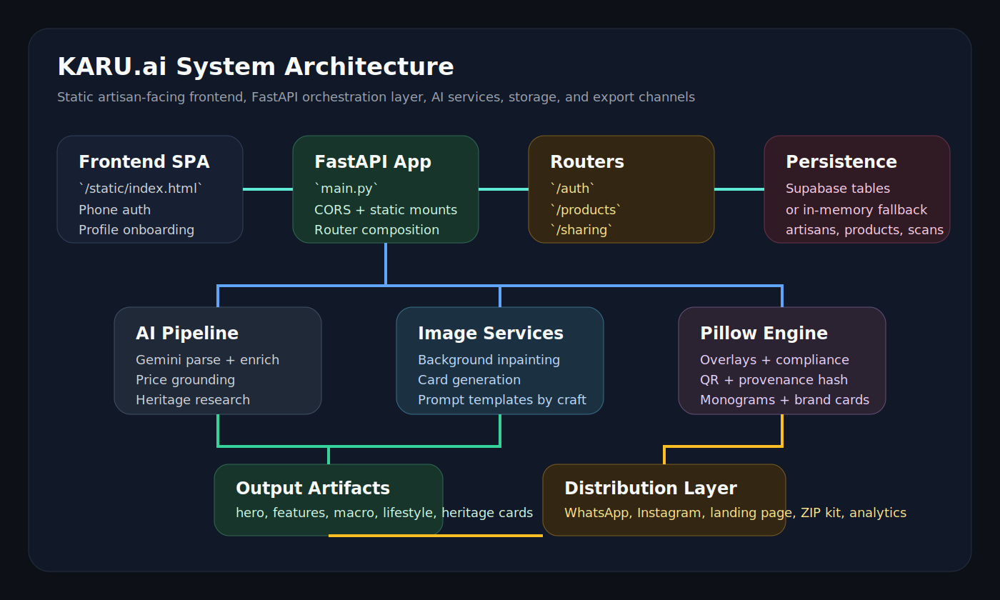
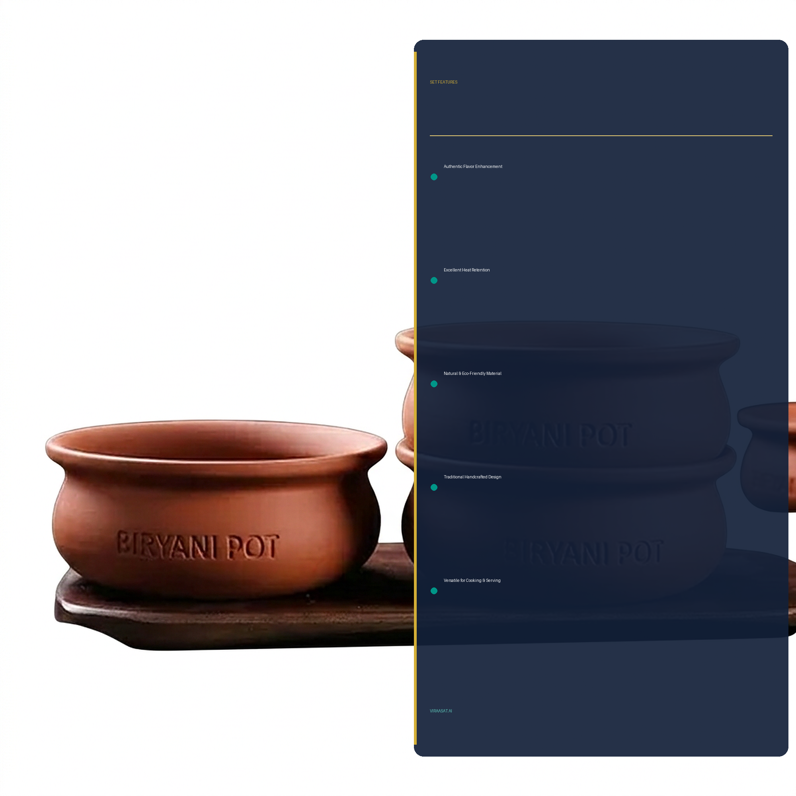

# KARU.ai

KARU.ai is an AI-powered digital agency for artisans. An artisan can sign in with a phone number, create a profile, upload product photos, describe the item in voice or text, and receive commerce-ready listing assets in minutes: generated product cards, pricing guidance, SEO keywords, a heritage story, share captions, a landing page, a ZIP export kit, and QR-backed provenance metadata.

The current repository contains a FastAPI backend and a static single-page frontend. One implementation detail is important up front: the product branding in code is still mixed between `KARU.ai` and `Viraasat.ai`. The UI has already been updated toward `KARU.ai`, but several backend modules, filenames, generated assets, and prompts still use `Viraasat.ai`.



## Product Snapshot

- Phone-first onboarding for artisans with low digital literacy
- Demo OTP flow for hackathon-style onboarding
- Artisan profile setup with craft tags, language, district/state, UPI, and profile image
- AI parsing of product image + voice description using Gemini
- Parallel enrichment with heritage research and market price advice
- Commerce card generation for `hero`, `features`, `macro`, `lifestyle`, and `heritage` variants
- Pillow-rendered overlays for crisp branding, features, labels, QR codes, and provenance
- Sharing outputs for WhatsApp, Instagram, landing pages, downloadable kits, and brand cards
- Lightweight storage via Supabase, with in-memory fallback for local/demo mode

## Visuals

### System Flow


### Sample Generated Assets

| Hero card | Features card | Macro card |
| --- | --- | --- |
|  |  |  |

## Problem It Solves

Many artisans can produce exceptional work but struggle to digitize it well enough for modern commerce. Typical blockers are:

- weak product photography
- no listing copy or SEO knowledge
- uncertainty around fair pricing
- no simple distribution path to WhatsApp, Instagram, or a landing page
- inconsistent trust signals for online buyers

KARU.ai compresses that entire workflow into one guided interface.

## End-to-End User Journey

1. The artisan opens the root page served from `GET /`.
2. They enter a mobile number and request an OTP.
3. In demo mode, any 6-digit code passes verification.
4. New users complete profile setup with name, district, state, craft type, optional UPI, language, and optional profile photo.
5. Returning users are taken straight to the dashboard with progress stats and prior products.
6. In the studio, the artisan uploads 1 to 5 product photos and adds a voice/text description.
7. The backend parses the input, enriches the product data, estimates pricing, and generates card imagery.
8. Pillow overlays finalize the assets and the product is saved with metadata, generated images, and a provenance hash.
9. The results screen exposes cards, price ranges, SEO keywords, product details, heritage story, and sharing actions.
10. The artisan can open a landing page, download a ZIP kit, copy an Instagram caption, launch a WhatsApp share link, or download a brand card.

## How The Pipeline Works

### 1. Frontend orchestration

The frontend lives in [`static/index.html`](static/index.html) and [`static/styles.css`](static/styles.css). It implements:

- top-level navigation across welcome, OTP, profile, dashboard, and results screens
- theme toggling with `localStorage`
- OTP digit entry UI
- profile photo preview and craft chip selection
- product photo previews
- browser speech recognition support for multilingual input
- quality scoring based on photos, description length, and product type
- sharing actions and image lightbox support

### 2. Authentication and profile flow

`routers/auth.py` provides the onboarding surface:

- `POST /auth/register`
- `POST /auth/verify`
- `POST /auth/profile`
- `GET /auth/profile/{artisan_id}`
- `PUT /auth/profile/{artisan_id}`
- `GET /auth/profile/{artisan_id}/completion`
- `GET /auth/profile/{artisan_id}/monogram`

Important behavior:

- OTP is mocked for demo mode.
- Existing users are detected by phone number.
- Profile completion is gamified with nudges.
- A monogram can be generated even without a profile photo.

### 3. Product generation pipeline

`routers/products.py` is the main orchestration layer. The central endpoint is `POST /products/generate`.

It performs these phases:

1. Validates the artisan profile.
2. Reads uploaded photos and selects the first photo as the primary reference.
3. Starts Gemini parsing and heritage enrichment in parallel.
4. Uses parsed output to launch price advice and card generation in parallel.
5. Runs Pillow overlay composition and compliance checks.
6. Saves generated artifacts under `output/{product_id}`.
7. Stores product metadata and auto-enriches the artisan profile.

### 4. AI services

The AI layer is split across several services:

- `services/ai_pipeline.py`
  - image + voice parsing into structured JSON
  - A/B testing between two variants
  - voice intro extraction for onboarding enrichment
- `services/price_advisor.py`
  - market-aware pricing guidance
  - negotiation coaching
- `services/heritage.py`
  - heritage origin and cultural significance enrichment
- `services/image_generator.py`
  - inpainting and image generation using Gemini image models
- `templates/prompts.py`
  - craft-aware prompt templates for textiles, pottery, jewelry, woodwork, metalwork, and generic fallback

### 5. Image finishing and trust layer

`services/pillow_engine.py` performs:

- hero card finishing
- feature panel overlays
- heritage overlays
- macro detail labels
- lifestyle branding
- QR code generation
- provenance hash generation
- monogram creation
- brand card creation
- color extraction
- compliance checks for e-commerce readiness

### 6. Distribution layer

`routers/sharing.py` exposes:

- `GET /sharing/{product_id}/whatsapp`
- `GET /sharing/{product_id}/instagram`
- `GET /sharing/{product_id}/facebook`
- `GET /sharing/{product_id}/landing-page`
- `GET /sharing/{product_id}/download-kit`
- `GET /sharing/{product_id}/brand-card`
- `GET /sharing/{product_id}/analytics`
- `POST /sharing/{product_id}/scan`

These endpoints generate reusable commerce outputs without needing the frontend to rebuild anything.

## Repository Structure

```text
Karu.ai/
├── main.py                    FastAPI entrypoint and static mounts
├── config.py                  Environment loading, models, paths, constants
├── database.py                Supabase client + in-memory fallback store
├── models.py                  Pydantic request/response models
├── routers/
│   ├── auth.py                OTP and artisan profile APIs
│   ├── products.py            Product generation, retrieval, pricing, A/B testing
│   └── sharing.py             Distribution, landing pages, download kits, analytics
├── services/
│   ├── ai_pipeline.py         Structured Gemini parsing and analysis
│   ├── image_generator.py     Product image generation/inpainting
│   ├── pillow_engine.py       Overlay rendering, QR, brand assets
│   ├── price_advisor.py       AI price guidance and negotiation coach
│   ├── heritage.py            Heritage enrichment
│   └── profile_service.py     Profile creation, enrichment, badge logic
├── templates/
│   ├── prompts.py             Category-specific image prompts
│   └── landing_page.html      Product landing page HTML template
├── static/
│   ├── index.html             Single-page web app
│   ├── styles.css             Frontend styling
│   └── favicon.svg            Brand icon
├── output/                    Generated product assets
├── verify.py                  Lightweight verification script
└── requirements.txt           Python dependencies
```

## Tech Stack

### Backend

- Python
- FastAPI
- Uvicorn
- Pydantic v2
- Python Multipart

### AI

- Google Gemini `gemini-2.5-flash`
- Google Gemini `gemini-3.1-flash-image-preview`

### Imaging

- Pillow
- qrcode

### Persistence

- Supabase
- In-memory fallback when Supabase is not configured

### Frontend

- Static HTML, CSS, and vanilla JavaScript
- Bootstrap Icons CDN
- Google Fonts
- Web Speech API for voice capture

## Environment Variables

The backend reads configuration from `.env` through `python-dotenv`.

Required for the full AI-enabled experience:

```env
GEMINI_API_KEY=your_gemini_api_key
SUPABASE_URL=your_supabase_project_url
SUPABASE_KEY=your_supabase_service_or_anon_key
HOST=0.0.0.0
PORT=8000
ALLOWED_ORIGINS=*
```

Notes:

- If `SUPABASE_URL` and `SUPABASE_KEY` are absent, the app falls back to in-memory storage.
- If `GEMINI_API_KEY` is missing, routes depending on Gemini will fail.

## Local Setup

### 1. Install dependencies

```bash
pip install -r requirements.txt
```

### 2. Configure `.env`

Add the environment variables shown above.

### 3. Start the server

```bash
uvicorn main:app --reload
```

### 4. Open the app

```text
http://127.0.0.1:8000
```

The root route serves the static frontend automatically.

## Data Model Summary

### Artisan profile

Key profile fields include:

- `id`
- `phone`
- `name`
- `district`
- `state`
- `craft_types`
- `upi_id`
- `preferred_language`
- `heritage_story`
- `experience_years`
- `skills`
- `trust_score`
- `brand_colors`
- `badge_level`
- `product_count`

### Product record

Each product stores:

- `id`
- `artisan_id`
- `product_type`
- `materials`
- `description_json`
- `original_photos`
- `generated_images`
- `trust_score`
- `provenance_hash`
- `price_suggested`
- `seo_keywords`
- `created_at`

### Scan analytics

Each scan record includes:

- `id`
- `product_id`
- `scanned_at`
- `action_taken`

## API Summary

### Health and app shell

- `GET /`
- `GET /health`

### Auth and profile

- `POST /auth/register`
- `POST /auth/verify`
- `POST /auth/profile`
- `GET /auth/profile/{artisan_id}`
- `PUT /auth/profile/{artisan_id}`
- `GET /auth/profile/{artisan_id}/completion`
- `GET /auth/profile/{artisan_id}/monogram`

### Products

- `POST /products/generate`
- `GET /products/{product_id}`
- `GET /products/artisan/{artisan_id}`
- `GET /products/{product_id}/card/{card_type}`
- `POST /products/{product_id}/ab-test`
- `POST /products/{product_id}/price-advice`
- `POST /products/{product_id}/negotiate`

### Sharing and exports

- `GET /sharing/{product_id}/whatsapp`
- `GET /sharing/{product_id}/instagram`
- `GET /sharing/{product_id}/facebook`
- `GET /sharing/{product_id}/landing-page`
- `GET /sharing/{product_id}/download-kit`
- `GET /sharing/{product_id}/brand-card`
- `GET /sharing/{product_id}/analytics`
- `POST /sharing/{product_id}/scan`

## Generated Outputs

For each successful generation, the system can produce:

- a hero product image
- a feature-benefit image with copy-safe whitespace
- a macro detail image
- a lifestyle image
- a heritage context image
- pricing recommendations
- SEO keyword suggestions
- a narrative heritage block
- platform-specific captions
- a ZIP export kit
- a landing page
- a printable brand card

## Verification and Testing

The repository includes `verify.py`, a basic endpoint verification script.

Run it with:

```bash
python verify.py
```

What it covers:

- root and health checks
- mock auth flow
- profile creation and retrieval
- profile update
- profile completion
- monogram endpoint
- duplicate profile handling
- selected 404 handling

What it does not fully cover:

- real Gemini generation
- full image pipeline quality checks
- Supabase integration behavior
- end-to-end browser automation

## Current Strengths

- Clear backend separation between routers, services, templates, and models
- Good demo-mode experience because auth and storage can work without full infrastructure
- Strong visual asset pipeline for a hackathon or MVP
- Structured Pydantic models for most request/response objects
- Reusable sharing and export endpoints

## Current Gaps and Risks

These are visible from the codebase and worth acknowledging in a professional README:

- branding is inconsistent between `KARU.ai` and `Viraasat.ai`
- OTP is demo-only and not production authentication
- some endpoint decorators use `POST` for read-like operations such as price advice
- generated provenance URLs are hardcoded to `viraasat.ai`
- there is no formal test suite beyond `verify.py`
- there is no database migration or schema documentation in the repo
- generated outputs live on local disk, so horizontal scaling would need shared storage
- frontend and backend are tightly coupled through hardcoded route assumptions

## Suggested Production Roadmap

- unify naming across frontend, backend, assets, and generated URLs
- replace mock OTP with Firebase, Twilio, or another verified phone auth provider
- move generated asset storage to object storage
- add structured logging and request tracing
- define Supabase schema and migrations
- add automated tests for routers and service layers
- add queueing for long-running image generation tasks
- introduce auth/session management for real user isolation

## Why This Project Matters

KARU.ai is not just a listing generator. It is an attempt to package merchandising, storytelling, pricing, and trust infrastructure into a single phone-friendly workflow for artisans who should not need to become digital marketers to sell their craft well.

## Status

This repository is best understood as a strong MVP or hackathon-grade prototype with meaningful product depth:

- the user journey is real
- the backend surface area is substantial
- the AI orchestration is ambitious
- the final production hardening work is still pending

If you want to continue this project, the highest-leverage next step is to align the branding and productionize authentication and storage.
